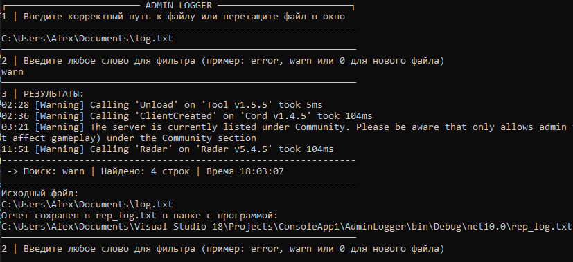

# AdminLogger
Console log monitoring tool for errors, warnings and critical events (C#)
## 🚀 Features
- Log levels (INFO, WARNING, ERROR & etc)
- Console output and autoclear
- Keyword filtering
- Timestamp support
- Autoexport of selection
- Visual status

Workflow:
1. Enter file path
2. Type filter word
3. Results shown instantly
4. Report saved automatically

Screenshot:
